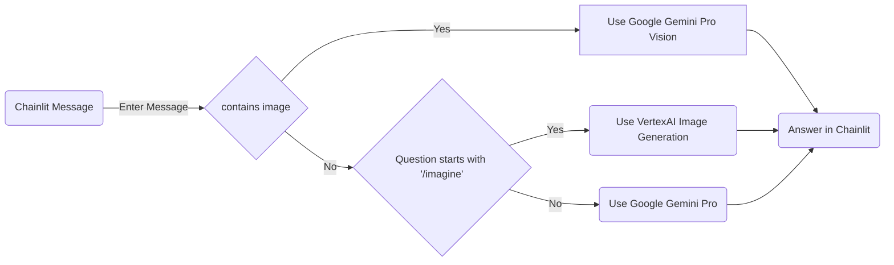

#ChatBot with Image and Text Generation using Google Gen AI

##Introduction

Google Gen AI is a suite of generative AI models that enables developers to create text, images, and other types of content. In this blog post, I'll show you how to use Gen AI to build a simple chatbot that can generate both text and images in response to user input.

##Workflow

##Prerequisites

A Google Cloud account
A Python environment with the following libraries installed:
streamlit
google-generativeai
vertexai
PIL
io

##Step 1: Initialize the Generative AI Model

First, we need to initialize the Gen AI models that we'll be using. We'll use three models:

model: A text generation model
model_vision: A vision model that can generate images
model_image: A pre-trained image generation model

python
import streamlit as cl
import google.generativeai as genai

from google.cloud import storage
import PIL
import requests
import io
from google.generativeai.types import HarmCategory,HarmBlockThreshold
import vertexai
from vertexai.preview.vision_models import ImageGenerationModel

PROJECT_ID="solid-sun-418711"
LOCATION="us-west1"

model = genai.GenerativeModel('gemini-pro')
model_vision = genai.GenerativeModel('models/gemini-pro-vision')
model_image = ImageGenerationModel.from_pretrained('imagegeneration@006')

##Step 2: Create a Chatbot Interface

Next, we'll create a simple chatbot interface using Streamlit.

python
@cl.on_chat_start
def on_chat_start():
    print("A new chat session has started!")

@cl.on_message
async def on_message(message: cl.Message):

##Step 3: Handle Image and Text Generation

Inside the on_message function, we'll handle different types of user input.

If the user uploads an image, we'll use the model_vision model to generate an image in response.

python
if(len(message.elements) > 0):
    storage_client = storage.Client()
    bucket = storage_client.bucket('chainlit-genai-vision-bucket')

    blob = bucket.blob(message.elements[0].name)

    blob.upload_from_filename(message.elements[0].path)

    blob_as_string = blob.download_as_string()

    bytes = io.BytesIO(blob_as_string)
    img = PIL.Image.open(bytes)
    response = model_vision.generate_content([message.content,img],safety_settings=safety_settings)

If the user enters a text message starting with /imagine, we'll use the model_image model to generate an image based on the prompt.

python
elif(message.content.startswith("/imagine")):
    prompt = message.content

    response = model_image.generate_images(prompt=prompt)     

Otherwise, we'll use the model model to generate text.

python
else:
    response = model.generate_content(message.content, safety_settings=safety_settings) 

Step 4: Send the Response

Finally, we'll send the generated response back to the user.

python
if(isinstance(response,vertexai.preview.vision_models.ImageGenerationResponse)):
    answer = cl.Message(content="", elements=[cl.Image(url=blob_path, name=file_name, display="inline")])

elif len(response.candidates) > 0:
    answer = cl.Message(content=response.candidates[0].content.parts[0].text)
elif len(response.parts) > 0:
    answer = cl.Message(content=response.parts[0].text)
else: 
    answer = cl.Message(content=response) 

await answer.send()

