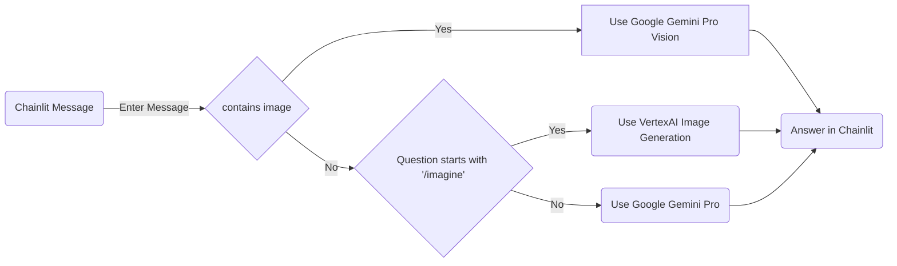

# chainlit_googlegenai

```mermaid
    flowchart LR
        A(Chainlit Message) -->|Enter Message| B{contains image}
        B -->|Yes| C[Use Google Gemini Pro Vision]
        B -->|No| D{Question starts with '/imagine'}
        D --> |Yes| E(Use VertexAI Image Generation)
        D --> |No| F(Use Google Gemini Pro)
        C --> G(Answer in Chainlit)
        E --> G
        F --> G
```